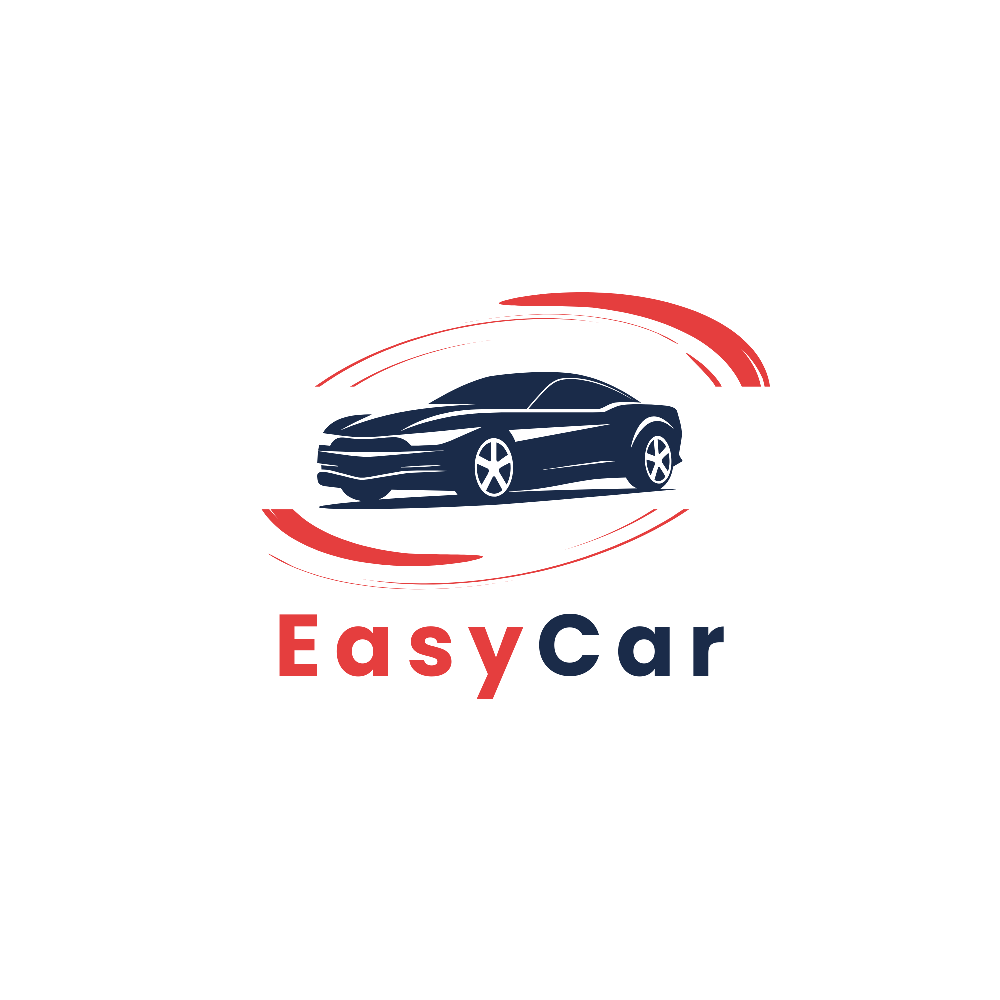

### CAHIER DES CHARGES : APPLICATION DE GESTION DE LOCATION DE VOITURE "EASYCAR"
**Contexte du projet**
Le secteur de la location de voitures au Maroc connaît une croissance importante, mais de nombreuses agences locales gèrent encore leurs flottes de manière traditionnelle ou via des outils bureautiques limités (tableurs Excel, registres papier).

Le manque de centralisation des informations et l’utilisation de processus manuels chronophages engendrent des risques majeurs d’erreur de planification, notamment l’indisponibilité imprévue de véhicules ou des conflits de réservation (Overbooking) pour une même période.

Par ailleurs, l’absence d’outils numériques fluides pour donner une visibilité immédiate sur les caractéristiques techniques des véhicules ralentit le processus de décision des clients. Le projet EasyCar est né pour répondre à ces problématiques en fournissant une solution numérique centralisée, moderne et simple d’utilisation, automatisant la relation entre l’administration de l’agence et les clients.

**Objectifs du projet**
L’objectif principal de ce projet est de développer une application web centralisée, destinée à moderniser le processus de location de voitures et visant à :

Centralisation des données : Suivre l’état de la flotte en temps réel pour l’administrateur (véhicules disponibles, loués ou en maintenance).

Automatisation du calcul de tarification : Générer automatiquement le coût total de la location en multipliant le tarif journalier du véhicule choisi par le nombre exact de jours réservés.

Amélioration de l’expérience utilisateur : Permettre un ciblage ultra-rapide des véhicules grâce à des filtres technologiques fluides exécutés côté client.

Sécurisation des flux : Assurer le chiffrement des données d’accès et la persistance des rôles via un système de session rigoureux.

**Fonctionnalités Principales**
1. Zone Publique & Espace Client (Front-Office)
Ces pages sont accessibles aux visiteurs et aux clients connectés. Elles respectent scrupuleusement la charte graphique définie (Bleu Marine #1A2B49, Rouge Accent #E53E3E, police Poppins).

Page d'Accueil (Landing Page / Catalogue Interactif) :

Présentation de l'agence et vitrine de la flotte automobile.

Intégration du moteur de recherche avec le filtre dynamique en JavaScript (filtrage instantané par type de carburant et boîte de vitesse sans rechargement).

Formulaire de sélection des dates (début et fin de location).

Page d'Inscription (Sign Up) :

Formulaire numérique de création de compte pour les nouveaux clients (avec hachage sécurisé du mot de passe en PHP).

Page de Connexion (Sign In) :

Formulaire unique d'authentification pour les utilisateurs.

Vérification du rôle par script PHP (via $_SESSION) pour rediriger automatiquement soit vers l'espace client personnalisé, soit vers le dashboard administratif.

Page Détails du Véhicule & Réservation :

Affichage de la fiche technique complète de la voiture sélectionnée.

Calcul automatique du prix total en Dirhams (DH) basé sur l'intervalle de jours de la période choisie.

Bouton de soumission de la demande (qui enregistre la réservation avec le statut "En attente" par défaut).

Espace Personnel du Client (Dashboard Client) :

Historique individuel et suivi en temps réel de l'état d'avancement des demandes de location (En attente, Confirmée, Annulée).

2. Interface Administrative (Back-Office)
Ces pages forment le tableau de bord de gestion global. Elles sont strictement protégées par session : un client ou utilisateur non connecté qui tente d'y accéder est automatiquement redirigé vers la page de connexion.

Tableau de Bord Principal (Dashboard Admin) :

Vue d'ensemble et statistiques en temps réel sur l'état de la flotte (suivi des véhicules disponibles, loués ou actuellement en maintenance).

Gestion de la Flotte (Pages CRUD Véhicules) :

Page Liste : Vue globale de toutes les voitures du parc avec filtres de recherche rapides.

Page Ajouter : Formulaire d'insertion d'un nouveau véhicule (saisie du tarif journalier, caractéristiques, etc.).

Page Modifier : Formulaire de mise à jour des spécifications techniques ou des prix d'un modèle.

Suppression : Option pour retirer un modèle obsolète de la vitrine.

Gestion des Réservations & Communication :

Liste centralisée de toutes les demandes de location reçues.

Affichage clair des coordonnées du client avec bouton d'action rapide vers WhatsApp ou Téléphone pour la validation externe.

Commandes manuelles à la disposition de l'administrateur pour faire basculer le statut de la réservation en "Confirmée" ou "Annulée" après confirmation.

**Les acteurs**
L’application implique deux profils utilisateurs, chacun ayant des rôles et des droits spécifiques :

Administrateur (Gestionnaire de l'Agence) :

Supervise l’ensemble du système et possède un accès total au panneau de contrôle (Back-office).

Gère le parc automobile (Ajout, modification, suppression de véhicules).

Modifie la disponibilité des voitures et valide ou rejette les demandes de location après confirmation externe (téléphone ou WhatsApp).

Client (Utilisateur Final) :

Navigue sur le site et utilise le filtre JavaScript pour trouver un véhicule adapté (selon la boîte et le carburant).

Soumet ses dates de voyage, effectue sa demande de réservation et consulte l’état d’avancement de ses dossiers depuis son espace personnel.

**Charte graphique**
**Logo**
Le logo a été conçu pour refléter le dynamisme et la fluidité de l'application de location EasyCar. Il représente :

Une silhouette de voiture de sport profilée en bleu marine, évoquant la performance, le professionnalisme et la sécurité de la flotte.

Des arcs de cercle dynamiques en rouge accent entourant le véhicule, symbolisant la rapidité du service, la fluidité du processus et la mobilité.

Le nom EasyCar écrit avec une typographie épurée, mettant en avant la simplicité d'utilisation de la plateforme.

**Typographie**
Police principale : Poppins (Regular, Medium, Bold selon les besoins d’affichage sur supports mobiles et desktop).

Palette de Couleurs
Primaire : #1A2B49 (Bleu Marine - Exprime la confiance, le professionnalisme et la rigueur).

Accent : #E53E3E (Rouge Accent - Apporte de la vitalité, utilisé pour les boutons et les incitations à l'action).

Background : #F8FAFC (Gris Clair - Garantit un design épuré, propre et moderne).

**Travail à Réaliser**
Dans le cadre de mon projet fil rouge, je me concentrerai sur la réalisation complète des modules fonctionnels suivants :

Gestion des utilisateurs et système d'authentification sécurisé (Sessions, Hachage).

Gestion de la flotte automobile (Dashboard Administrateur - CRUD complet).

Moteur de recherche et catalogue dynamique côté client (Filtrage JS).

Gestion du cycle des réservations avec calcul automatique des tarifs et module de validation.

**Calendrier de Mise en Œuvre**
Phase 1 : Analyse et Conception (3 semaines) : Recueil des besoins, modélisation de la base de données (MCD/MLD Merise) et création des maquettes UI/UX sur Figma.

Phase 2 : Développement (1 mois) : Développement backend (PHP), intégration de la base de données (MySQL) et développement frontend (HTML5/CSS3/JavaScript).

Phase 3 : Tests et Déploiement (1 semaine) : Tests unitaires, validation des fonctionnalités de réservation sans conflit, et retours utilisateurs.

**Technologies Utilisées**
Backend : PHP 8 (Natif) / PHP PDO (Requêtes préparées).

Frontend : HTML5, CSS3, JavaScript (ES6) pour le filtrage local.

Base de Données : MySQL.

Environnement Local : XAMPP / phpMyAdmin.

Outils Annexes : Figma (Maquettage), Git / GitHub (Gestion de versions).